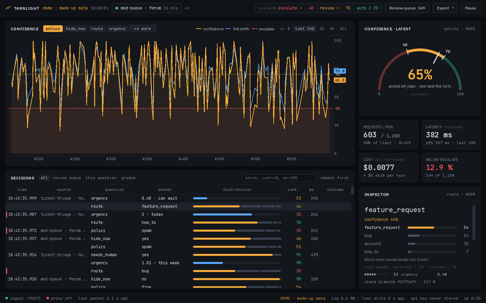

# Tarnlight

**A flight recorder for Jev, an AI model sold by the company TypeSafe.** Tarnlight records the answers your apps get from Jev, shows them live and lets you grade them, so you learn how far to trust Jev on your own questions.



*The window playing the built-in demo (made-up data). Across the top: the toolbar. Left: the confidence chart (CONFIDENCE), with the decisions list (DECISIONS) under it. Right, from the top: the gauge (CONFIDENCE · LATEST), four counters and the inspector (INSPECTOR). Along the bottom: the status bar. The [user guide](USER_GUIDE.md#a-tour-of-the-window) explains each one.*

Tarnlight is a free, open-source Windows app. It is unofficial and not affiliated with TypeSafe.

## Why it exists

Apps send Jev small questions, such as "which team should handle this ticket?" or "is this post spam?". Jev answers with a pick and a confidence: a number from 0 to 100 for how sure it is.

Two words come up all the time below. A **call** is one request your app sends to Jev. A **decision** is one answer to one question in that call. One call can ask several questions, so one call can make several decisions.

Many apps use the confidence to decide what happens next. They act alone when it is high and hand the case to a person when it is low. The hard part is knowing where to draw that line. A confidence says how sure Jev sounds, not how often it is right on your data. On your questions, "80" might be right 95 times in 100, or 55. The number alone cannot tell you which.

The way to find out is to keep score: record each decision, mark whether it was right, and compare. Tarnlight does the recording, the live view and the scoring, on your own computer.

## What you need

- **To try it:** a Windows PC and nothing else. The built-in demo plays made-up data. It needs no account, no key and no programming.
- **To use it on your real data:** an app that already calls Jev, and someone who can do one of these two things:
  - add one small file and a few lines of code to that app (the drop box, below), or
  - start that app from PowerShell, the Windows command window, with one extra setting (the proxy, below).

If you use an app that you cannot change or start that way, the demo is as far as Tarnlight can take you.

Tarnlight runs on Windows only.

## What it does

- **Records every decision your apps get from Jev**, with the question, the input and the full answer. You can look back at exactly what Jev said, even hours later.
- **Shows them live.** A chart of confidence over time, the latest answer on a gauge, and counters for speed, cost and the rate limit (TypeSafe's cap of 1,200 calls a minute). You notice at a glance when answers turn unsure or calls start failing.
- **Lets you grade them** with one key each: 1 correct, 2 wrong, 3 flagged (not sure yet, look again later). Grades are what turn "80" into "right 9 times in 10 on my data".
- **Lets you set your own lines for each question.** Tarnlight calls them **bands**. Below one number a person should look; at or above another, the app can act alone. You see at once how many decisions each band catches, before you change anything in your app.
- **Stays out of the way.** With the drop box (below), your apps keep calling TypeSafe directly, and closing Tarnlight never breaks or slows a Jev call.

The view that draws confidence against your grades (a calibration chart) is not built yet. Your grades are stored today and can be exported to a spreadsheet.

## Try it in one minute

1. Download `Tarnlight-<version>-windows.zip` from the [Releases page](https://github.com/TheChyeahhh/tarnlight/releases).
2. Right-click the zip and choose **Extract All**, then **Extract**. Open the folder that appears, then the `Tarnlight` folder inside it. Do not run the app from inside the zip: it needs the `_internal` folder next to it, and that only works once the zip is extracted.
3. Double-click `Tarnlight.exe`. Windows may show a blue box that says **"Windows protected your PC"**, because the app is not signed yet. (Signing is a paid certificate that tells Windows who made a program.) Click **More info**, then **Run anyway**.
4. The window opens on a nearly empty screen that says "Waiting for Jev decisions". Press the button on it, **Try the demo (made-up data)**. A second window opens and plays invented Jev traffic from three pretend apps.
5. Then follow [Your first five minutes](USER_GUIDE.md#your-first-five-minutes) in the user guide. It walks you through the window one step at a time.

The demo sends nothing to TypeSafe and needs no account or key. When you close its window, everything it made is deleted.

## Connect your own Jev calls

This part needs someone who can edit your app's code, or start it from PowerShell. If that is not you, send them this section.

There are two ways in. Use one of them per app, not both, or each call shows up twice.

### The drop box (recommended)

Once you add a tap (step 2), your app leaves a copy of each Jev call in a folder on your computer: the drop box. Tarnlight reads that folder whenever it is open, including the calls made while it was closed. Your app never waits for Tarnlight, and your API key (the secret code your app uses to sign in to TypeSafe and pay for calls) never passes through it.

1. Open Tarnlight once. It turns the drop box on by itself: it makes the folder `.tarnlight\inbox` in your user folder, which stays from then on. Nothing else on your computer changes.

2. Add a tap to your app. A tap is one small file from the [taps](taps/) folder that writes the copies for you. For an app written in Python that uses TypeSafe's Python SDK (the toolkit TypeSafe gives programmers for calling Jev), copy `taps/python/tarnlight_tap.py` next to the app's main Python file and wrap the client like this:

   ```python
   try:
       from tarnlight_tap import attach
   except Exception:                    # no tap file: the app runs as before
       def attach(client, **_): return client

   client = attach(TypeSafeClient(), source="ticket-triage", project="support")
   ```

   `source` is the name Tarnlight shows for your app. `project` is an optional group name, shown next to it. The JavaScript version, and every option, are in [taps/README.md](taps/README.md).

3. Open Tarnlight. Your app shows up in the toolbar under its `source` name.

### The proxy (one app, one run)

A proxy is a middleman. While Tarnlight is open, it runs one on your computer at `http://127.0.0.1:7338`. (127.0.0.1 always means "this computer".) Point one app at it for one run, and each call passes through Tarnlight on its way to TypeSafe and back, unchanged. No code changes are needed.

This works for apps built with TypeSafe's own toolkits, the official Python and JavaScript SDKs. They read a setting called `TYPESAFE_BASE_URL` to know where to send calls. Open PowerShell and type the first line, then start your app the way you normally do, in this same window. When the app is done, type the last line:

```powershell
$env:TYPESAFE_BASE_URL = "http://127.0.0.1:7338/p/support"
# now start your app here, the way you normally do
Remove-Item Env:TYPESAFE_BASE_URL
```

The first line points the app at Tarnlight. The `/p/support` at the end puts these calls in a project named `support`; use any name you like, or leave `/p/support` off. The last line removes the setting.

The setting lasts only in that PowerShell window. Keep Tarnlight open while the app runs: with Tarnlight closed, that app's calls fail. So **never set `TYPESAFE_BASE_URL` for the whole machine**, in Windows settings or anywhere else. If Tarnlight finds a setting like that pointing at a proxy that is not running, it shows a red banner.

## What it stores, and what it never does

- **Your API key is never stored.** With the drop box it never reaches Tarnlight at all. The proxy passes it on to TypeSafe and does not keep your key or any other sign-in details from the call.
- **Everything stays on your computer**, in the `.tarnlight` folder in your user folder (for example `C:\Users\you\.tarnlight`):
  - `sessions\`: one main file for each time you open Tarnlight (a `.jevlog` file, Tarnlight's own record of one session), with a few small helper files of the same name beside it. It holds every call's question, input and answer, plus your grades. That can include anything your apps sent to Jev, so treat these files like your apps' own data.
  - `inbox\`: the drop box. Each file in it holds one hour of calls. A file is deleted once everything in it is stored and its hour is over (a few minutes after the hour ends), so the current hour's file stays even after Tarnlight has read it. A small `.positions.json` file there records how far Tarnlight has read.
  - `bands.json`: your bands for each question.
- **It works offline.** No account, no sign-in, no usage reports, no update check.
- **It never calls TypeSafe on its own.** The proxy only passes on calls your app makes. The one exception is the inspector's **replay this one** button, which sends one new call to TypeSafe. That call is paid, like any other.
- **To remove it:** delete the `.tarnlight` folder (this also turns the drop box off) and the unzipped `Tarnlight` folder. There is no installer. The only other thing it writes is a small log of its own messages in `%TEMP%\tarnlight`.
- **To turn the drop box off but keep your sessions and bands,** run `.\tarnlight-cli.exe uninstall` instead. It stays off until you open Tarnlight again. Open Tarnlight once first, so it reads in any copies still waiting: `uninstall` deletes copies it has not read in yet, and tells you how many.

## Install from source

For programmers. If you downloaded the zip, skip this.

You need Python 3.11 or newer.

```
git clone https://github.com/TheChyeahhh/tarnlight
cd tarnlight
pip install .
tarnlight              # open the window
tarnlight demo         # the demo, from the command line
tarnlight install      # make the drop box without opening the window
```

`tarnlight uninstall` removes the drop box. `tarnlight replay FILE.jsonl` plays a saved JSONL file of calls (a text file with one record per line) into an open window. With the zip download, the same commands start with `.\tarnlight-cli.exe` instead of `tarnlight`.

Only Windows is supported: the app is built and tried only on Windows (the automated tests also run on Linux).

## Learn more

- [USER_GUIDE.md](USER_GUIDE.md): every panel and button, what it means and why you would use it, with pictures.
- [taps/README.md](taps/README.md): the tap files for Python and JavaScript apps.
- [DESIGN.md](DESIGN.md): how it works inside, with measurements. For programmers.

## Contributing

Issues and pull requests are welcome. The maintainer reviews every change before it goes in.

To run the tests:

```
pip install -e ".[dev]"
python -m pytest
```

Please keep real API keys and real call data out of issues and pull requests.

## License

Apache-2.0. See [LICENSE](LICENSE).

The release zip also carries the licences and notices for everything bundled inside the app: `THIRD_PARTY_NOTICES.txt`, `QT_NOTICE.txt` and the `licenses` folder. The two fonts, IBM Plex Sans and JetBrains Mono, are under the SIL Open Font License.

---

Tarnlight is an unofficial project. It is not affiliated with, endorsed by or supported by TypeSafe. TypeSafe and Jev are named here only to say what Tarnlight works with.
