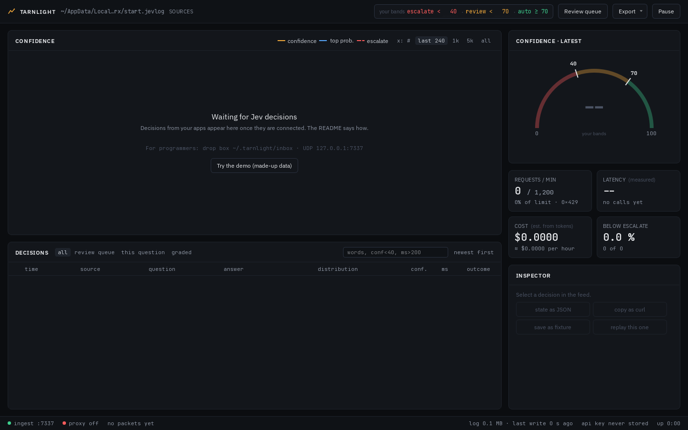
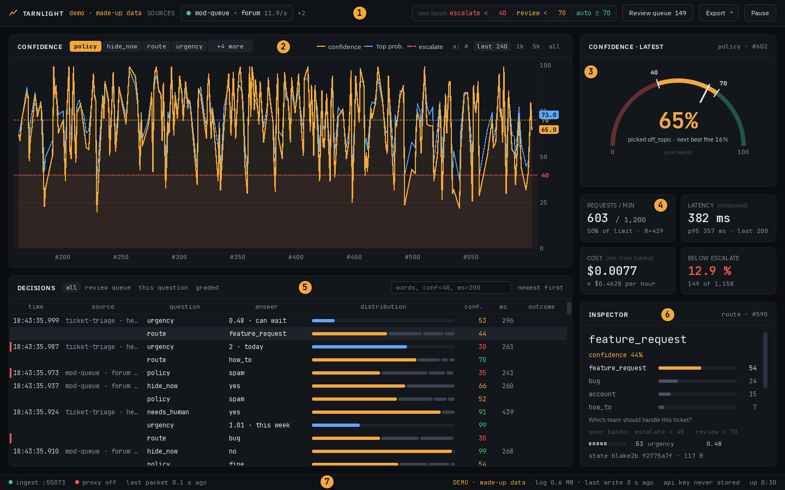
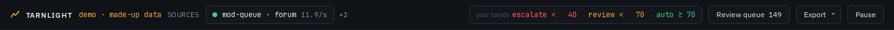
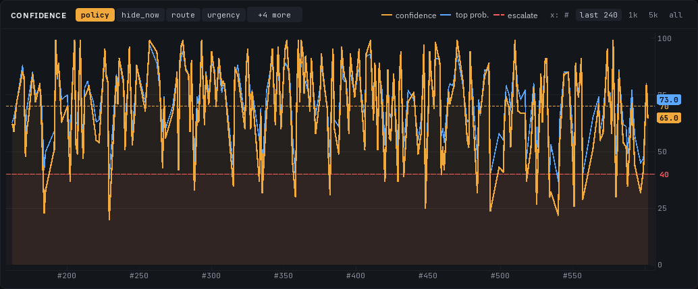
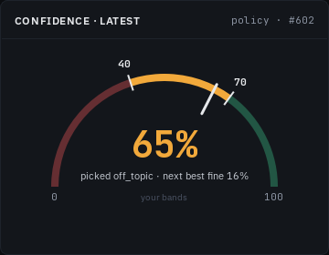
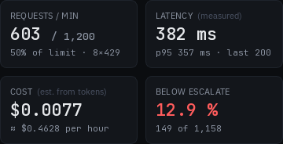
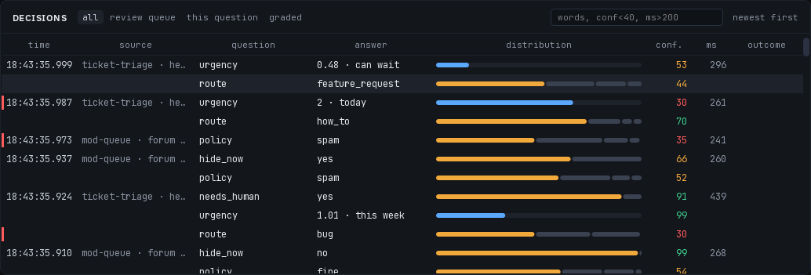
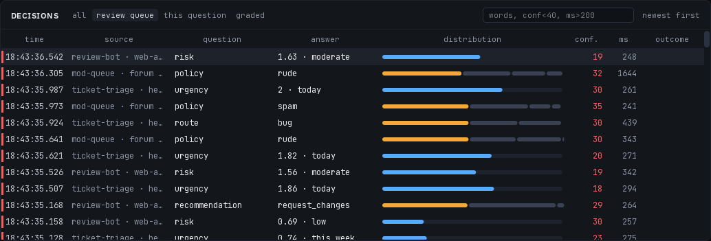
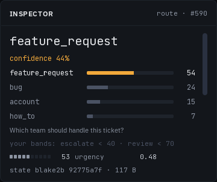
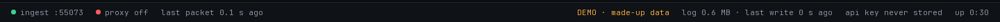

# Tarnlight user guide

This guide explains every part of the Tarnlight window: what it shows, what each button does, and why you would use it. It is written for anyone, not just programmers. For downloading and setup, see the [README](README.md).

Every picture here comes from the built-in demo, so all the data in them is made up.

**Contents:** [What Tarnlight is for](#what-tarnlight-is-for) · [Your first five minutes](#your-first-five-minutes) · [A tour of the window](#a-tour-of-the-window) · [Grading](#grading) · [Keyboard](#keyboard) · [Everyday recipes](#everyday-recipes) · [Glossary](#glossary) · [Questions and answers](#questions-and-answers)

## What Tarnlight is for

Jev is an AI model sold by the company TypeSafe. Apps ask it small, narrow questions: "Which team should handle this ticket?", "Does this post break a rule?", "How urgent is this?". Jev answers each one with a pick and a **confidence**, a number from 0 to 100 for how sure it is.

Two words come up all the time. A **call** is one request your app sends to Jev. A **decision** is one answer to one question in that call. One call can ask several questions, so one call can make several decisions.

Apps often use the confidence as a switch. Above some line, the app acts on its own. Below it, a person decides. Where to put that line is the real question, and the confidence alone cannot answer it. Confidence tells you how sure Jev sounds. It does not tell you how often Jev is right on your kind of question.

Think of a weather forecast. A forecast of "70% rain" is only useful if it really rains on about 7 of every 10 days with that forecast. The only way to check is to keep score over many days. Jev's confidence works the same way. On your data, answers at 80 might be right 95 times in 100, or only 55. You find out by keeping score.

That is what Tarnlight is for:

1. It **records** every decision your apps get from Jev, on your own computer.
2. It **shows** them live, so you see what Jev is saying and how sure it is.
3. It lets you **grade** each one as correct, wrong or flagged (not sure yet, look again later), with a single key.

Over time your grades show how far each confidence number can be trusted, for each question you ask. A chart that draws this for you (the calibration view) is planned but not built yet. Your grades are stored now, and you can export them to a spreadsheet today.

What Tarnlight does **not** do: it never changes what your app does, it never grades anything by itself, and it never picks the cut-off numbers your app uses. It gives you the evidence. You decide, and put the numbers in your own code.

## Your first five minutes

The demo is the safest way to learn the window. It plays made-up Jev traffic, sends nothing to TypeSafe, needs no key and keeps nothing.

**One rule for later, with real data: export before you close.** The window only shows the current session, so export your grades as a CSV file before you close Tarnlight (see [Grading](#grading)). In the demo nothing is kept anyway.

**Open it.** Start `Tarnlight.exe`. (If Windows says the app is from an unknown developer and will not run it, see [Questions and answers](#questions-and-answers) at the end.) The first screen is nearly empty: it says "Waiting for Jev decisions", then one faint line that starts "For programmers" (you can ignore it), then a button.

Press **Try the demo (made-up data)** and the demo opens in a second window. (From PowerShell in the Tarnlight folder, `.\tarnlight-cli.exe demo` does the same at any time.) The demo window says "demo · made-up data" in its toolbar and status bar.

**What you are looking at.** Three pretend apps are sending calls:

- `mod-queue`, a forum's moderation queue. It asks `policy` (which rule does this post break, if any?) and, for posts that readers reported, `hide_now` (should this post be hidden before a moderator sees it?).
- `ticket-triage`, a helpdesk. It asks `route` (which team should handle this ticket?), `urgency` (how soon does it need an answer?) and sometimes `needs_human` (does this ticket need a person rather than a help article?).
- `review-bot`, a code reviewer that looks at changes programmers want to make to a program. It asks `recommendation` (approve the change, ask for changes, or just comment?), `risk` (how risky is this change?) and sometimes `tests_cover_change` (do the tests cover this change?).

About 3 calls in 100 fail on purpose, so you can see what failures look like. The demo runs 5 times faster than real life and keeps going with fresh data until you close it.

**Minute 1: watch.** The chart and the gauge show one question at a time: the one asked most, `policy` here. The gauge shows that question's newest answer. Notice how the amber line on the chart jumps between sure and unsure. The counters tick up.

**Minute 2: look closer.** Press **Space** to pause. Click any row in the decisions list. The inspector on the right shows that decision in full. Scroll down in the inspector and click **state as JSON** to read the post or ticket Jev was judging. JSON is a plain-text layout programmers use, so you will see braces and quote marks. The post or ticket text is inside the quote marks: after `"text"` for a post, after `"subject"` and `"body"` for a ticket.

**Minute 3: grade.** Your **escalate** number is the confidence below which a person should decide: 40 to start. On the chart it is the red dashed line. Start with posts, which are easy to judge: press **/**, type `mod-queue` and press **Enter**. Then click **Review queue** in the toolbar. The list now shows only that app's answers below escalate: the ones Jev was least sure about. Read the first one, decide whether Jev got it right, and press **1** (correct), **2** (wrong) or **3** (flagged). If you cannot tell, 3 is fine. The next one is selected for you. Try `ticket-triage` next. The `review-bot` answers are about code, so they are hard to judge unless you write code.

**Minute 4: move a line.** Hover over the red dashed line on the chart until it gets thicker, then drag it up to about 60. Watch the Review queue count and the Below escalate counter jump: more decisions now count as needing a person. To put it back, click the red number in the toolbar (it now says 60), delete it with **Backspace**, type 40 and press **Enter**.

**Minute 5: finish.** Press **Space** to resume. Close the demo window. Everything it made, including your grades and bands, is deleted. Your main window is not touched.

## A tour of the window

The window has seven parts, numbered in the picture. Most panels also show their name in small capital letters at their top left:

1. The **toolbar**, across the top.
2. The **confidence chart** (CONFIDENCE), top left.
3. The **gauge** (CONFIDENCE · LATEST), top right.
4. The **four counters**, the small boxes under the gauge.
5. The **decisions list** (DECISIONS), bottom left, under the chart.
6. The **inspector** (INSPECTOR), bottom right.
7. The **status bar**, the thin strip along the bottom edge.

The sections below follow the same order.

### Colours

The same four colours come back all over the window:

- **Red: needs a person, or something went wrong.** Decisions below escalate, a wrong grade, a failed call, a part of Tarnlight that stopped.
- **Amber: Jev's own answer, and the middle band.** The confidence line, Jev's pick in the bars, the review band, the question on the chart, a flagged grade, short status messages.
- **Green: fine.** The auto band, a correct grade, an app that is sending.
- **Blue: extra information.** The chart's second line, score bars, calls you sent again with **replay this one**, and the line that marks calls from the drop box. Blue never means good or bad, and blue in one panel is not linked to blue in another.

### The toolbar

From left to right:

**Name and session.** "TARNLIGHT", then the file this run is recorded in. The toolbar shows it in a short form, such as `~/.tarnlight/sessions/2026-09-26-01.jevlog`, where `~` means your user folder. In File Explorer that is `C:\Users\you\.tarnlight\sessions\2026-09-26-01.jevlog`: the date and that day's run number. A `.jevlog` file is Tarnlight's own record of one session. Each time you open Tarnlight, a new session and a new file start. In the demo this says "demo · made-up data" instead.

**Sources.** One chip for each app that is sending calls, named by its source and project, such as `mod-queue · forum`. The dot is green if that app sent a call in the last 5 seconds, grey if it has gone quiet. The number is its calls per second over the last 10 seconds. When there are more apps than fit, the rest sit behind a chip like "+2". In the picture, the other two demo apps, `ticket-triage` and `review-bot`, are behind +2; hover over it to see them.
*Why you'd use it:* you see at once which apps are talking to Jev right now, and notice when one stops.

**Your bands.** These are the lines from [What Tarnlight is for](#what-tarnlight-is-for): two numbers you choose for the question on the chart, shown as `escalate < 40 · review < 70 · auto ≥ 70`. They split every decision into three bands by its confidence:

- **escalate** (red), below the first number: a person should decide.
- **review** (amber), from the first number up to the second: fine to act on, but worth checking now and then.
- **auto** (green), at the second number and above: the app could act alone.

For example, with escalate 40 and review 70 on the `policy` question: Jev says "spam" at 35, so it is red, gets a red edge in the list and joins the Review queue. Jev says "rude" at 55, so it is amber. Jev says "fine" at 91, so it is green.

Watch out for one name clash: **the Review queue holds the red (escalate) decisions, not the amber review ones.**

To change a number, click the red 40 or the amber 70 in the toolbar (each has a faint dashed underline), delete it with **Backspace**, type the new number and press **Enter**. **Escape** cancels. You can also drag the dashed lines on the chart. Bands are kept separately for each question name, saved at once, and still there next time you open Tarnlight. Escalate can never end up above review: moving one pushes the other along if needed.
*Why you'd use it:* to try out a cut-off and see how many decisions it would send to a person, before you put that number in your app. Bands only change what Tarnlight shows. They never change what your app does, and Jev does not set them.

**Review queue.** The button shows how many decisions are below escalate and not graded yet, for the whole session (149 in the picture). Click it to show just those in the list, with the first one selected. Again: these are the red (escalate) decisions, not the amber review ones.
*Why you'd use it:* it is your to-do list of the answers Jev was least sure about.

**Export.** Saves the session to a file. Press **E** to open it from the keyboard. There are three choices:

- **Decisions as JSONL (full records):** every call in full, in a JSONL file (a text file with one record per line). This one is for programmers. A programmer can play it back into a Tarnlight window later with `.\tarnlight-cli.exe replay FILE.jsonl`. Replay brings back the calls, not your grades. To keep your grades, export the CSV.
- **Index and grades as CSV:** one row per decision with its numbers and your grade, but not the inputs. A CSV file is a plain table that Excel and other spreadsheets open. See [the recipe](#export-your-grades-to-a-spreadsheet).
- **Share bundle (.zip):** a compact copy of the whole session with your grades and a short note on the file format. To keep, or to pass on.

The export runs in the background, and the status bar says where the file went. The JSONL file and the bundle hold everything your apps sent to Jev, so only share them with people allowed to see that data.

**Pause.** Freezes the chart, the gauge and the list, so rows stay put while you read or grade. Recording carries on: nothing is lost, and the counters and status bar keep running. The button then says **Resume**. **Space** does the same.

### The confidence chart

**The essentials.** The chart shows one question at a time, oldest answers on the left and newest on the right. The amber line is Jev's confidence. The dashed lines are your bands. Click anywhere on the chart to open the decision closest to that spot.

- **Question chips.** Up to four question names across the top. The one on the chart is amber. Click a chip to chart that question. After you click a chip, the chart stays on your pick until you close Tarnlight. The other questions hide behind "+N more": click it for a list of them, each with the app that asks it.
- **The amber line is confidence**, from 0 at the bottom to 100 at the top. The soft shading under it follows the same line.
- **The blue line** is a second view of the same answers. Confidence is Jev's own sureness figure; the blue line is the share Jev gave its first choice (the **top probability**). They usually move together; when they split, look closer. For yes/no questions the blue line is **p(yes)**, the chance of "yes", and the legend says so.
- **The dashed lines** are your bands: red for escalate (40 in the picture), amber for review (70). The amber one is thin and easy to lose among the amber confidence line. Find it by its 70 tag on the right edge, just under the 75 on the scale. The legend at the top names only the red one. To move a line, hover over it until it gets thicker, then drag it up or down. That sets that band for this question.
- **Click anywhere on the chart** and the decision closest to that spot, left to right, opens in the list and the inspector. The line has no dots to aim at, and the height of your click does not matter. If a filter hides that decision, the filter is cleared.

*Why you'd use it:* patterns jump out here. A question that is always unsure, a sudden drop after you changed your app, or a slow slide over the day.

Details

- **How the chart picks a question.** Until you click a chip, Tarnlight charts the question that came up most in the last 1,000 decisions. It only switches when another question becomes clearly more common, so the chart does not flip back and forth. When the charted question is one of the hidden ones, the "+N more" chip shows its name.
- **The red zone** is a very faint red tint below escalate, hard to see in the picture. Decisions in it land in the Review queue.
- **Tags on the right edge** show the latest confidence (in its band colour), the latest blue-line value, and your two band numbers. The 70 tag sits right next to the 75 on the scale, so the two can look jumbled.
- **The margin switch (optional).** Click "top prob." in the legend to switch the blue line to the **margin**: the top probability minus the runner-up's. A small margin means a near tie between two answers, which is worth a look even when the confidence seems fine. Click it again to switch back.
- **x: #** switches the bottom axis between decision numbers (#200, #250 and so on) and clock time. Every call gets the next number as it arrives.
- **last 240, 1k, 5k, all** choose how many of this question's latest decisions to show. "all" means everything the chart holds, up to 20,000.

### The gauge

The gauge shows the newest decision for the question on the chart (not the newest decision overall). Its header names the question and the decision number (`policy · #602`).

- **The big percent** is that decision's confidence, coloured by your bands.
- **The arc** is your bands: red below escalate, amber for review, green for auto. The long white needle points at the latest confidence. The short ticks mark your two numbers, 40 and 70. The band the needle is in is bright; the other two are dim. The words "your bands" under the arc are a reminder that you set these colours, not Jev.
- **The plain-words line** says what Jev answered:
  - for a choice: what it picked and how close the runner-up came, such as "picked off_topic · next best fine 16%". When the two are within 5 points it says "near tie". Jev's pick is not always its likeliest option; when that happens, the line says which option was likelier.
  - for a yes/no: the answer and p(yes), such as "says yes · p(yes) 0.83".
  - for a score: the nearest level, such as "about level 2: today".
- **The streak box** appears under the gauge when the latest decision is below escalate, and counts how many in a row are: "Below escalate 4 decisions in a row".
  *Why you'd use it:* one unsure answer is normal. A run of them can mean the inputs changed or something upstream broke.
- **Hover over the gauge** for a reminder: "Confidence is how concentrated the answer is, not whether it is right." In plain words: confidence is how strongly Jev leaned toward one answer, not whether that answer is right. A 90 can still be wrong. Only your grades tell you how often.

### The four counters

- **REQUESTS / MIN:** calls that arrived in the last minute, next to TypeSafe's limit of 1,200 a minute. Under it: how much of the limit that is, and how many calls this session were refused for going over the limit. In the picture, `8×429` means 8 calls were refused that way. (429 is the code TypeSafe sends back for "too many requests".)
  *Why you'd use it:* past the limit, TypeSafe refuses calls. This shows how close you are.
- **LATENCY (measured):** latency is how long a call took. This is the average over the last 200 calls, as measured by your app or the proxy. Under it: the **p95**, the time that 95 calls in 100 beat.
  *Why you'd use it:* slow answers make your app slow. A few very slow calls, such as timeouts, can pull the average above the p95, as in the picture.
- **COST (est. from tokens):** the estimated cost of this session's calls, and what an hour would cost at the last minute's pace. It is worked out from the number of tokens (pieces of text) in each request, at TypeSafe's published price, so it is always an estimate. Your TypeSafe bill is the real number.
  *Why you'd use it:* you catch a runaway loop before it costs real money.
- **BELOW ESCALATE:** the share of this session's decisions that fell below their question's escalate number, with the count ("149 of 1,158"). It turns red when there are any.
  *Why you'd use it:* roughly how much work your current bands would hand to a person. Move a band and it is recounted for the whole session.

### The decisions list

**The essentials.** Every decision, newest first, one row per question. Click a row to open it in the inspector. Your grade shows in the last column. The words "newest first" at the top right are only a reminder of the order, not a button.

A call that asked three questions makes three rows, and its time, source and ms show only on the first of them.

| Column | What it shows |
|---|---|
| time | When the call was made, to the thousandth of a second |
| source | Which app sent it: its source (the name the app gave itself), its project (an optional group name) and the call's label if it has one (a short tag an app can put on one call). In the demo every label is "demo". Blue text means a call you sent again with **replay this one** |
| question | The question's name, as your app calls it |
| answer | Jev's answer: the option it picked, yes or no, or for a score the number and its nearest level ("1.63 · moderate"). For a failed call, what failed, in red |
| distribution | A small bar. For a choice or yes/no: Jev's pick in amber and every other option in grey, each as wide as its probability. For a score: one blue fill, as far along as the score sits on its scale. For a failed call: an empty striped bar |
| conf. | The confidence, coloured by your bands: red below escalate, amber for review, green for auto |
| ms | How long the call took, in milliseconds |
| outcome | Your grade, as a small coloured tag: correct (green), wrong (red) or flagged (amber). Empty until you grade it |

The source column has a fixed width, so long names are cut off with "…", as in the picture. Widening the window does not change that. To see an app's full name and project, look at its chip in the toolbar (hover over "+2" for the hidden ones).

Other marks in the list:

- **A red edge** on the left of a row means it is below escalate. Only what needs a person is marked.
- **A blue line** across the list marks the calls that were waiting in the drop box when Tarnlight opened. It sits just above the newest of them. Everything below it was made while Tarnlight was closed.
- **Failed calls** get one row each, with what failed in the answer column: a status number such as `429` (too many requests) or `401` (the key was refused), `timeout`, `unreachable` (TypeSafe could not be reached), `cut off` (the answer stopped halfway), `no answer`, or a short note. A failed call has no answer, so it cannot be graded.

**Presets** sit at the top of the list:

- **all:** everything.
- **review queue:** below escalate and not graded yet (the red rows, not the amber review ones). When you grade a row it leaves, and the next one takes its place.
- **this question:** only the question on the chart.
- **graded:** only what you have graded, to check your work. To find your flagged ones, open **graded** and look for amber "flagged" in the outcome column.

**The filter box** narrows the list. Press **/** to jump to it. Words match the question, the source or the answer (not the grade). `conf` (confidence) and `ms` compare numbers with `<`, `<=`, `>`, `>=` or `=`. Several terms together must all match. Some examples:

| Type this | To see |
|---|---|
| `conf<40` | decisions with confidence under 40 |
| `conf>=90` | very sure decisions |
| `ms>200` | calls slower than 200 milliseconds |
| `spam` | any decision with "spam" in its question, source or answer |
| `route conf<50` | `route` decisions under 50 |
| `mod-queue` | one app's decisions |
| `timeout` | calls that timed out |

The list updates as you type, after a short pause. **Enter** applies the filter at once and hands the keys back to the list, and so does **Escape**.

Details

- When you have a row selected or have scrolled down, new rows arrive above without moving what you are looking at.
- The list holds the newest 100,000 decisions. Older ones stay in the session file but cannot be graded from the window.

### The inspector

**The essentials.** The inspector shows the selected decision in full: Jev's answer, how sure it was, what it was asked and what it was shown. Scroll down inside it for more, and for four buttons at the bottom.

Its header names the question and the decision number (`route · #590`). The inspector has no headings of its own, so here is what each part looks like, from top to bottom. The picture shows parts 1 to 7; scroll down for the rest.

1. **The answer**, in large type (`feature_request` in the picture).
2. **Its confidence**, in its band colour (`confidence 44%`).
3. **A bar for each option**, likeliest first, with its probability. Jev's pick is amber.
4. **What was asked**, in small grey text: the question's instructions as your app sent them ("Which team should handle this ticket?").
5. **Your bands** for this question, in dim text: "your bands: escalate < 40 · review < 70".
6. **The call's other questions**, one line each: ten small blocks (one per 10 points of confidence), the confidence, the name and the answer. In the picture, the same call also asked `urgency` and got 0.48 at confidence 53.
7. **The input**, which Jev calls the **state**: the line that starts "state blake2b". Under it, each of the input's main pieces on its own line, starting with "▸".
8. **What changed** since the same app's previous call: a line that starts "changed since #", then each part that changed, old value → new value.
   *Why you'd use it:* when an answer suddenly flips, this often shows what caused it.
9. **One line of facts:** the tokens in and out, the milliseconds, the estimated cost, the status, and TypeSafe's request id, which helps if you ever ask TypeSafe about one specific call.

For a failed call, you see what failed in red, the note "A failed call: no answer, nothing to grade.", and the error message it came back with.

Details

- **Confidence and top probability are different numbers.** In the picture, `feature_request` has a probability of 54, but the confidence is 44. For choice and score questions the confidence is Jev's own figure, and TypeSafe does not publish how it is worked out. For yes/no, Tarnlight uses the larger of p(yes) and p(no).
- **A yes/no question** shows bars for "yes" and "no"; a score shows each level by name.
- **The state line**, such as "state blake2b 92775a7f · 117 B", is a short fingerprint of the input (a code that changes if any letter of the input changes) and its size in bytes. Two calls with the same fingerprint had exactly the same input.

**Four buttons** sit at the bottom of the inspector, in two rows of two (scroll down to reach them):

- **state as JSON:** shows the whole input, laid out for reading. Click again to hide it.
  *Why you'd use it:* to read the post, ticket or other text Jev was judging, before you grade.
- **For programmers: copy as curl.** Copies a command that sends this same call again from a terminal. (curl is a common command-line tool for web requests.) Your key is not copied: the command says `$TYPESAFE_API_KEY` where the key goes. The command is written for a bash-style terminal, such as Git Bash.
  *Why you'd use it:* to show a developer the exact call that went wrong.
- **For programmers: save as fixture.** Saves this one call as a JSON file. A "fixture" is a saved example that a test feeds to your code.
  *Why you'd use it:* to turn a real mistake into a test, so it cannot come back unnoticed.
- **replay this one:** sends the same request to TypeSafe again, through Tarnlight's proxy, and records the new answer like any other. It shows up in the list with the source "replay" in blue, labelled with the old decision's number. **This is a new call, and TypeSafe charges for it.** It needs the proxy running, and it is greyed out in the demo, which has no proxy.
  *Why you'd use it:* to see whether Jev gives the same answer a second time.

**Setting your key for replay this one.** The button needs your API key in a Windows setting named `TYPESAFE_API_KEY`. This kind of setting is called an environment variable: a named setting that programs can read. To add it:

1. Open the Start menu and search for "environment variables".
2. Choose **Edit environment variables for your account**.
3. Under the top list, click **New**.
4. Enter `TYPESAFE_API_KEY` as the name and your key as the value, then click **OK** twice.

Tarnlight reads it from there. This is a different setting from `TYPESAFE_BASE_URL`, which you should never set this way (see the [README](README.md#the-proxy-one-app-one-run)).

### The status bar

**The essentials.** The ingest light at the far left should be green. The proxy light next to it only matters if you use the proxy (it is always red in the demo). The text after them says how long ago the last call arrived. Notes appear only when they matter.

From left to right:

- **The ingest light** (`ingest :7337`). The ingest is the part of Tarnlight that takes calls in. Green means it is listening. Red means it stopped: close and reopen Tarnlight.
- **The proxy light** (`proxy :7338`). Green means the proxy is ready for an app you point at it. Red "proxy off" means it could not start, usually because another program already uses its port; hover over it for the reason. The drop box works either way. The demo has no proxy, so it always shows "proxy off", as in the picture.
- **last call … ago** (the app shows it as "last packet … ago"): how long since the last call arrived ("no packets yet" at first). If your app is running and this keeps climbing, its calls are not reaching Tarnlight.
- **Messages** in amber for a few seconds: where an export went, how a replay went, or "Caught up: N calls from while Tarnlight was closed (below the blue line)."
- **DEMO · made-up data:** only in the demo.
- **log … MB · last write … s ago:** the size of this session's file, and how long since Tarnlight last wrote to it.
- **api key never stored:** a standing reminder.
- **up …:** how long this window has been open.

Details

- **The numbers after the lights.** 7337 and 7338 are ports. A port is a numbered door that programs on one computer use to talk to each other. The demo uses a random one.
- **Notes** that appear after "last packet" only when they apply:
  - "drop box off: reopen Tarnlight to turn it on": the drop box folder is missing, so taps write nothing. Tarnlight makes it every time it opens.
  - "catching up from the drop box": Tarnlight is reading in calls made while it was closed.
  - "N refused (see the rejects file)": records that were broken or in the wrong format. Tarnlight keeps the reason, the size and a fingerprint (never the content) in a rejects file next to the session file.
  - "N Jev calls forwarded but not recorded": the proxy passed calls on to TypeSafe but was too busy to record them.
  - "N not in the feed (paused longer than the live buffer holds)": you paused so long that some rows could not be added to the list. They are still stored.
  - "N not counted (the window fell behind)": the chart and counters missed some decisions. They are still stored.

**The red banner.** If a setting on your computer sends TypeSafe calls to a local address where no Tarnlight proxy is listening, a dark red strip appears across the window, just under the toolbar. It starts with "TYPESAFE_BASE_URL is". Calls that use that setting fail until you remove it. Tarnlight looks in its own settings, your Windows user settings and the settings of one programming tool, Claude Code.

## Grading

**Export the CSV before you close; the window only shows the current session.** See [the recipe](#export-your-grades-to-a-spreadsheet).

Select a decision in the list and press a key:

- **1, correct:** Jev's answer was right.
- **2, wrong:** it was wrong.
- **3, flagged:** you cannot tell yet, or it needs a second look.

"Right" means what really turned out to be true: the ticket really was a bug, the post really broke that rule. Judge by the outcome, not by whether the confidence looked believable.

The grade is saved to the session file at once, and the next row is selected, so you can grade a run of decisions without touching the mouse. A graded row shows a small coloured tag in the outcome column: "correct" in green, "wrong" in red or "flagged" in amber. Each question in a call is graded on its own. Failed calls cannot be graded.

A grade can be changed but not removed. To change one, select that row again (the **graded** view lists them all) and press a different key; the new grade replaces the old. If you pressed a key by mistake and are not sure, press **3**. To find your flagged ones later, open **graded** and look for amber "flagged" in the outcome column. The filter box does not search grades.

The keys only work while the list has the keyboard. Typing in the filter box or a band box never grades anything. Press **Escape** to hand the keys back to the list.

**Why grade?** Grades are the score you keep against the forecast. With enough of them for one question, you can see whether answers at 60 are right more often than answers at 40, and where the wrong ones pile up. That tells you where to put your bands. Until the calibration view is built, the CSV export gives you the grades to check in a spreadsheet: see [the simple check](#a-simple-check-in-a-spreadsheet) below.

**How many is enough?** A rough rule: a few dozen graded decisions (30 or more) in each block of 10 points (40 to 50, 50 to 60 and so on) before you trust what that block shows. With only a handful, a few lucky or unlucky answers swing the result. More is better.

**A ten-minute routine:**

1. Press **Space** to pause, so rows stay still.
2. Click **Review queue**. The first unsure decision is selected.
3. Read it in the inspector. Click **state as JSON** if you need the whole input.
4. Press **1**, **2** or **3**. The next one comes up.
5. After 10 or 20, switch to **all** and type `conf>=70` in the filter, then grade some of the confident ones too. If you only ever grade the unsure answers, you never learn whether the sure ones deserve your trust.
6. Press **Space** to resume.
7. Before you close Tarnlight, export the CSV.

**The T key.** Say you find a wrong answer at 52. Press **T** and escalate for that question becomes 53, one above it, so this decision and every one below it now count as needing a person. The Review queue and the Below escalate counter are recounted for the whole session, and the status bar confirms the new number. If review was lower than the new escalate, it moves up too.
*When to use it:* while exploring, to see how much work a stricter band would create. Base the number you put in your app on many grades, not on one wrong answer.

### A simple check in a spreadsheet

This is the payoff of grading: finding out whether a confidence number is honest for one question.

1. Export the CSV (see [the recipe](#export-your-grades-to-a-spreadsheet)) and open it in Excel or another spreadsheet.
2. Sort by the `question` column, then by the `confidence` column. (In Excel: **Data**, then **Sort**, then add both columns.)
3. Look at one question only. Leave out rows with an empty `outcome` (not graded) and, unless you have looked at them again, the `flagged` ones.
4. Take one block of 10 points at a time: confidence 400 to 499 (that is, 40 up to 50), then 500 to 599, and so on. In each block, count the rows marked `correct` and the rows graded in all.
5. Compare. If the rows around 70 are correct about 7 times in 10, that number is honest for that question. If they are correct only 5 times in 10, Jev sounds surer than it is there.

## Keyboard

| Key | What it does |
|---|---|
| **1** | Grade the selected decision correct, then move to the next row |
| **2** | Grade it wrong, then move on |
| **3** | Grade it flagged, then move on |
| **Up / Down** | Move through the list |
| **Space** | Pause or resume |
| **/** | Jump to the filter box |
| **E** | Open the Export menu |
| **T** | Set escalate one point above the selected decision |
| **Escape** | Cancel a band number you are typing, and give the keys back to the list |
| **Enter** | In a band box: apply the number. In the filter box: apply the filter now and go back to the list |

## Everyday recipes

### Watch an app's Jev calls

1. Open Tarnlight once. It turns the drop box on by itself, with nothing to type.
2. Add a tap to your app. The [README](README.md#the-drop-box-recommended) shows the Python lines, and [taps/README.md](taps/README.md) has JavaScript too.
3. Open Tarnlight and run your app. A chip with its name appears in the toolbar, and its questions appear as chips on the chart.

For a quick look at an app you would rather not change, point it at the proxy for one run instead (see the [README](README.md#the-proxy-one-app-one-run)).

### Find the decisions that need a person

Click **Review queue**. That shows every ungraded decision below escalate for this session. In the **all** view, the red edge marks the same rows, and `conf<40` in the filter finds everything under 40 whether graded or not.

### Set your own bands

1. Click the question's chip on the chart.
2. Change the numbers in the toolbar (click one, delete it with Backspace, type the new number and press Enter), or drag the dashed lines on the chart.
3. Watch the Below escalate counter and the Review queue count: that is how much work each band would hand to a person.
4. While grading, you can press **T** on a wrong answer to move escalate just above it, to see what a stricter band would mean.
5. Once many grades make you confident in a number, put that number in your app's code. Tarnlight never changes your app.

### Export your grades to a spreadsheet

1. Click **Export** (or press **E**) and pick **Index and grades as CSV**.
2. Choose where to save it. The status bar says when it is done.
3. Open the file in Excel or any spreadsheet. There is one row per decision. The most useful columns are `question`, `confidence`, `chosen`, `outcome` and `source`.
4. Confidence is shown times 10: 440 means 44. (`margin`, `top_prob` and `p_yes` work the same way.) For yes/no questions, `chosen` says `true` for yes and `false` for no.

Then try [the simple check](#a-simple-check-in-a-spreadsheet).

### Check a failed call

1. Look for red text in the answer column next to a striped bar, or type the failure into the filter: `timeout`, `429`, `unreachable`.
2. Click the row. The inspector shows the error message that came back.
3. Common causes:
   - **429:** too many requests. Your apps went over TypeSafe's limit. Check REQUESTS / MIN.
   - **401:** the key was refused. Check the key your app uses.
   - **timeout:** the answer took too long and your app gave up.
   - **unreachable:** TypeSafe could not be reached. Check the internet connection.
   - **cut off:** the answer stopped halfway.

### Close it any time

If you graded anything, [export the CSV](#export-your-grades-to-a-spreadsheet) first.

Close Tarnlight whenever you like. Apps that use the drop box are not affected at all: they keep calling TypeSafe directly and leave their copies in the folder. Next time you open Tarnlight, it reads them in, says "Caught up: N calls from while Tarnlight was closed", and draws a blue line in the list just above the newest of them, so everything below the line came in while Tarnlight was closed.

The one exception is an app you pointed at the proxy. Its calls fail while Tarnlight is closed, so stop that app first.

Each time you open Tarnlight, a new session starts. The old session's calls and grades stay in its file, but the window cannot reopen an old session yet, so export anything you want to work with before you close. Your bands carry over.

## Glossary

- **Jev:** an AI model sold by TypeSafe. TypeSafe calls it a System One model: its name for models that give quick typed answers (a pick, a yes or no, a score) instead of writing text.
- **Call:** one request your app sends to Jev. One call can ask several questions at once.
- **Decision:** one answer to one question in one call. A call with three questions makes three decisions.
- **Confidence:** a number from 0 to 100 for how strongly Jev leaned toward one answer. For choice and score questions it is Jev's own number. For yes/no questions, Tarnlight uses the larger of p(yes) and p(no). It is not the chance that the answer is right. Your grades measure that.
- **Yes/no:** a yes-or-no question. The answer is p(yes), the chance of yes, from 0 to 1. Jev's own name for this type is "noul", and that is what the `qtype` column of the CSV export says for these questions.
- **Choice:** pick one of several options. The answer is Jev's pick plus a probability for every option.
- **Score:** a place on a scale of levels, such as can wait, this week, today, right now. The answer is a number between the first level (0) and the last, and Tarnlight shows the nearest level's name next to it.
- **Bands:** your two numbers for a question, escalate and review, which split its decisions into escalate (red), review (amber) and auto (green). On the chart they are the dashed lines.
- **Escalate:** the lower band number. Below it, a person should decide.
- **Review queue:** the decisions below escalate (the red ones) that you have not graded yet. Not the amber review band.
- **Drop box:** the folder `.tarnlight\inbox` in your user folder. Apps with a tap leave a copy of each call there, and Tarnlight reads it in whenever it is open.
- **Tap:** a small file you add to your app that writes those copies for you.
- **Proxy:** a middleman that Tarnlight runs on your computer while it is open. An app pointed at it sends its calls through Tarnlight to TypeSafe and back, and Tarnlight records them on the way.
- **Session:** one run of Tarnlight, from opening to closing. Each session is one main `.jevlog` file in `.tarnlight\sessions`, with a few small helper files of the same name beside it.
- **Source:** the name an app gives itself, shown in the toolbar and the list.
- **Project:** an optional group name an app can add, shown after its source.
- **Label:** an optional short tag an app can put on one call, shown after the source and project.
- **State:** Jev's word for the input of a call: the post, ticket or other data Jev is asked to judge.
- **API key:** the secret code your app uses to sign in to TypeSafe and pay for calls. Tarnlight never stores it.
- **SDK:** a toolkit a company gives programmers for using its service. TypeSafe has one for Python and one for JavaScript.
- **Environment variable:** a named setting on your computer that programs can read, such as `TYPESAFE_API_KEY`.
- **JSON:** a plain-text layout programmers use for data, with braces and quote marks. The words inside the quote marks are the data.
- **JSONL:** a text file with one JSON record per line.
- **CSV:** a plain table in a text file. Excel and other spreadsheets open it.
- **Token:** a small piece of text, about a short word. TypeSafe prices calls by the tokens sent.
- **Latency:** how long a call took, in milliseconds.
- **p95:** the time that 95 calls out of 100 were faster than.
- **Port:** a numbered door that programs on one computer use to talk to each other.
- **429:** TypeSafe's answer when you send more than its limit of 1,200 requests a minute.

## Questions and answers

**Does closing Tarnlight break or slow my Jev calls?**
No. With the drop box, your apps call TypeSafe directly and never wait for Tarnlight, open or closed. Only an app you pointed at the proxy depends on Tarnlight being open, which is why the proxy is for one app at a time and never for the whole machine. If you never open Tarnlight, the copies simply wait in the drop box, and taps stop writing when the disk has less than 1 GB free.

**Is my API key stored?**
No, never. With the drop box the key never reaches Tarnlight at all. The proxy passes it on to TypeSafe and does not keep your key or any other sign-in details from the call. "copy as curl" writes `$TYPESAFE_API_KEY` instead of the key, and "replay this one" reads the key for that one request and keeps it nowhere.

**Does it cost money?**
Tarnlight is free, and watching your calls adds no cost. It never calls TypeSafe on its own. The one exception is the inspector's **replay this one** button: each press sends one new call, which TypeSafe charges like any other.

**Where is my data?**
In the `.tarnlight` folder in your user folder (for example `C:\Users\you\.tarnlight`). To open it, type `%USERPROFILE%\.tarnlight` into File Explorer's address bar. It holds `sessions` (one main `.jevlog` file per run, with every call and your grades, plus a few small helper files beside it), `inbox` (the drop box) and `bands.json` (your bands). Tarnlight uploads none of it: no account, no usage reports, no update check. The demo writes nothing there.

**How do I remove it?**
Delete the `.tarnlight` folder, which also turns the drop box off, and the unzipped `Tarnlight` folder. There is no installer. The only other file is a small log of the app's own messages in `%TEMP%\tarnlight`. To turn the drop box off but keep your sessions and bands, run `.\tarnlight-cli.exe uninstall` instead (it stays off until you open Tarnlight again). Open Tarnlight once first, so it reads in any copies still waiting: `uninstall` deletes copies it has not read in yet, and tells you how many. Taps left in your apps simply stop writing.

**Does it work on a Mac?**
Not yet. The download is for Windows, and only Windows is supported. Installing from source on a Mac might work, but it is not supported.

**Can I open yesterday's session?**
Not yet. Each start opens a new session. Old session files stay on disk, but the window only shows the session it started. Export what you need before closing. A programmer can play a JSONL export back into a new window with `.\tarnlight-cli.exe replay FILE.jsonl`, but that brings back the calls, not your grades. To keep your grades, export the CSV.

**Windows says "unknown developer" and will not run it.**
Tarnlight is not signed yet, so Windows does not know who made it. Delete the extracted folder. Right-click the downloaded zip, choose **Properties**, tick **Unblock** at the bottom of the General tab and click **OK**. Then extract the zip again and start `Tarnlight.exe`. If a blue "Windows protected your PC" box appears, click **More info**, then **Run anyway**.

**Is Tarnlight made by TypeSafe?**
No. Tarnlight is an unofficial project, not affiliated with or endorsed by TypeSafe.
